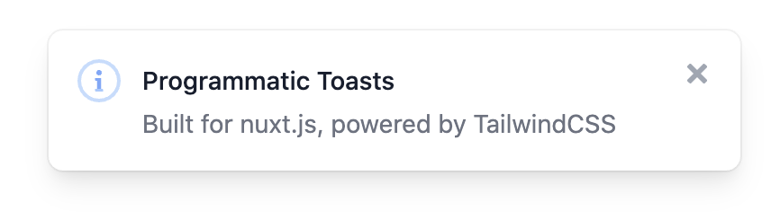
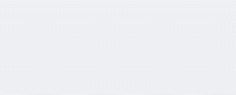
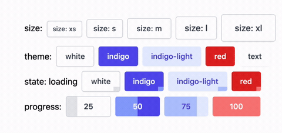
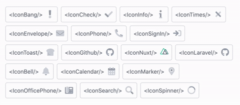

## nuxt-tailvue
> Nuxt.js module for for tailvue components

### tv-toast

  

- Please refer to the [tv-toast readme](https://github.com/acidjazz/tv-toast)

### tv-modal

  

- Please refer to the [tv-modal readme](https://github.com/acidjazz/tv-modal)

### tv-button

  

- Please refer to the [tv-button readme](https://github.com/acidjazz/tv-button)

### tv-icon

  

- Please refer to the [tv-icon readme](https://github.com/acidjazz/tv-icon)
